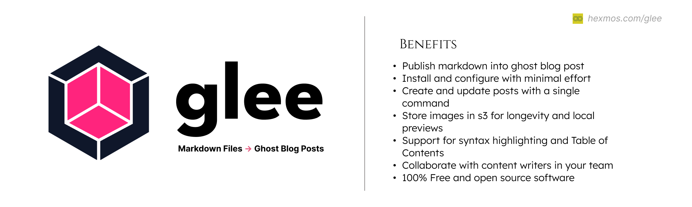

# glee: Publish Markdown Files to Ghost Blog 

<div align="center"> 


[](https://github.com/HexmosTech/glee/actions/workflows/build-and-release.yml)
</div>

## Overview

`glee` publishes markdown files into [Ghost](https://ghost.org/) blog posts. With glee, you can create and update ghost blogs. Since glee operates on plain markdown files, your blog posts are now git-friendly, allowing for easy collaboration.

`glee` command will read **metadata** from the YAML preface of your Markdown post ([sample_post.md](https://github.com/HexmosTech/glee/blob/main/sample_post.md?plain=1)), convert the post content into HTML, store the content images in AWS S3, and then publish it to your Ghost platform. Set up the `glee` CLI tool with a single command.

## Benefits
- Publish markdown files into Ghost blog post
- Install and configure with minimal effort
- Store images in ghost or  S3 for longevity and local previews
- Create and update posts with a single command
- Support for syntax highlighting and Table of Contents
- Collaborate with content writers in your team
- 100% Free and Open Source Software

## Installation/Update

For Linux/MacOS systems, run the following command to either install or update `glee`:

```bash
wget -O - https://raw.githubusercontent.com/HexmosTech/glee/main/install.sh | bash
```

## Configuration

After the installation, `glee` will create a configuration file ([.glee.toml](https://github.com/HexmosTech/glee/blob/main/.glee.toml)) in your home directory.

Open the configuration file `$HOME/.glee.toml` and modify the ghost, image backend and AWS S3 credential (optional).

### Ghost Configuration
#### Ghost Admin API Key
Admin API keys are used to generate short-lived single-use JSON Web Tokens (JWTs), which are then used to authenticate a request (GET,POST,PUT) using Ghost Admin API.
- Admin API keys can be obtained by creating a new Custom Integration under the Integrations screen in Ghost Admin.
 <p align="left">
  <a href="">
   
    <br/>
   </a>
</p>  

- Save the Custom Integration and Copy the Admin API Key to [.glee.toml](https://github.com/HexmosTech/glee/blob/main/.glee.toml) file.

 <p align="left">
  <a href="">
   
    <br/>
   </a>
</p>  

#### Ghost Version
Include the Ghost platform version in the TOML file. 
You can find the version in the Ghost admin settings.
The version notation is as follows: 'v4' represents version 4, 'v5' represents version 5, and so forth.
 <p align="left">
  <a href="">
   
    <br/>
   </a>
</p>  

#### Ghost URL
The `GHOST_URL` represents the domain where your Ghost blog is hosted.

### Image Storing Backend Configuration

All images in the markdown file are uploaded to a `ghost` database or an `s3` bucket. We calculate the hash for each image and use that as the filename in `s3`. This ensures that each unique image is stored only once in the server and that there are no naming conflicts.

1. **Your Ghost Database (default)**

  You can store the image in the same db where your content resides. To use Ghost as an image backend provide  `IMAGE_BACKEND = "ghost"` in the [.glee.toml](https://github.com/HexmosTech/glee/blob/main/.glee.toml#L13) file.

2. **AWS S3**

  Or, you can store the images in your AWS S3 bucket as well. To use S3 as an image backend provide `IMAGE_BACKEND = "s3"` in the [.glee.toml](https://github.com/HexmosTech/glee/blob/main/.glee.toml#L13) file.

Also, Configure the S3 Credentials in the [.glee.toml](https://github.com/HexmosTech/glee/blob/main/.glee.toml) file.

Find further [information](https://docs.aws.amazon.com/AmazonS3/latest/userguide/Welcome.html) and [tutorial](https://docs.aws.amazon.com/AmazonS3/latest/userguide/create-bucket-overview.html) to learn more about AWS S3.


## Usage 

After installation and configuration, you can convert Markdown file into a Ghost blog post using the following command:

```bash
glee your-post.md
```

## Markdown File Structure

The Markdown file used by `glee` consists mainly of two parts:
- A YAML Interface for metadata
- Content

```markdown
---
yaml
---
[TOC]
your content
```

### Example markdown file

See [sample_post.md](https://github.com/HexmosTech/glee/blob/main/sample_post.md?plain=1) for learning how to structure an example post. 
Find additional field reference in [official docs](https://ghost.org/docs/admin-api/#posts).

## Features
### Specifying author

The `authors` field in the markdown frontmatter can specify multiple
**staff emails**. Note that this is different from *member emails*.

### Draft vs Publishing

The YAML field `status` determines status of the post. Pick `status: draft` or `status: published`
as required.

### Slug field to support updating

If your post doesn't contain a `slug` field (post name in the URL), then `glee` will not publish.
This is to help with future updates/edits from the markdown file. If you see this error, give a url
friendly fragment as `slug` in your markdown:

> ERROR: Include a URL friendly slug field in your markdown file and retry! This is required to support updates

### Automatically generate Table of Contents (TOC)

`glee` support two kinds of TOC.

1. TOC in Content

For Adding TOC include the string `[TOC]` in your content area:

```markdown
---
yaml
---
[TOC]
your content
```
2. TOC as Sidebar

The YAML field `sidebar_toc` determines including sidebar table of content. Pick `sidebar_toc:true` or `sidebar_toc:false` as required.


### Syntax Highlighting

Languages supported: https://pygments.org/languages/

Fenced code blocks docs: https://python-markdown.github.io/extensions/fenced_code_blocks/

### Collaboration
When multiple team members are working simultaneously on the same Ghost blog, they can collaborate seamlessly using any version control system. `glee` will update the blog content with each `glee` command.

## Local Testing
Clone the repository and test the `glee` tool locally.

### Option 1: Build into a binary
Create a local standalone executable using nuitka. run the command:

```bash
./installbin.sh
```
After it's done, you can simply do:

```bash
glee your-post.md
```
### Option 2: Poetry standard method

```bash
poetry shell
python glee.py your-post.md
```

### Blog Post about glee

[glee for Ghost: Why we abandoned the Web Editor and Adopted Markdown Files](https://journal.hexmos.com/glee/)

## Acknowledgement

- The `glee` standalone single binary is created using [Nuitka](https://nuitka.net/doc/user-manual.html).
- `glee` utilizes the [Ghost Admin API](https://ghost.org/docs/admin-api/) for interaction with the Ghost blog platform.
