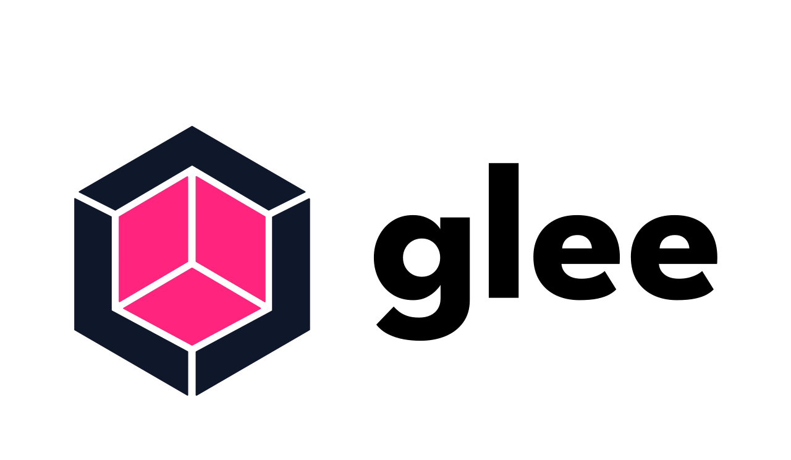

[TOC]
# My Simple Markdown File

This is  basic Markdown file with some common formatting elements.

## Headers

You can create headers using the `#` symbol. There are six levels of headers:

# Header 1
## Header 2
### Header 3
#### Header 4
##### Header 5
###### Header 6

## Text Formatting

You can make text **bold** using double asterisks or double underscores, and you can make it *italic* using single asterisks or single underscores.

## Lists

### Ordered List

1. Item 1
2. Item 2
3. Item 3

### Unordered List

- Item A
- Item B
- Item C

## Links

You can attach links like this: [glee](https://github.com/HexmosTech/glee).

## Images

You can embed images like this:
### jpg


### png


### jpeg


### gif


### svg



### ico


### heic

## Code

You can include inline code using backticks (`) like `code`.

For code blocks, use triple backticks (```):

```python
def hello_world():
    print("Hello, world!")
```

## Table 

| Name      | Age | Occupation |
| --------- | --- | ---------- |
| John      | 30  | Engineer   |
| Mary      | 25  | Designer   |
| Richard   | 35  | Teacher    |


## support html

<ul>
  <li>Coffee</li>
  <li>Tea
    <ul>
      <li>Black</li>
      <li>Green tea</li>
    </ul>
  </li>
  <li>Milk</li>
</ul>


